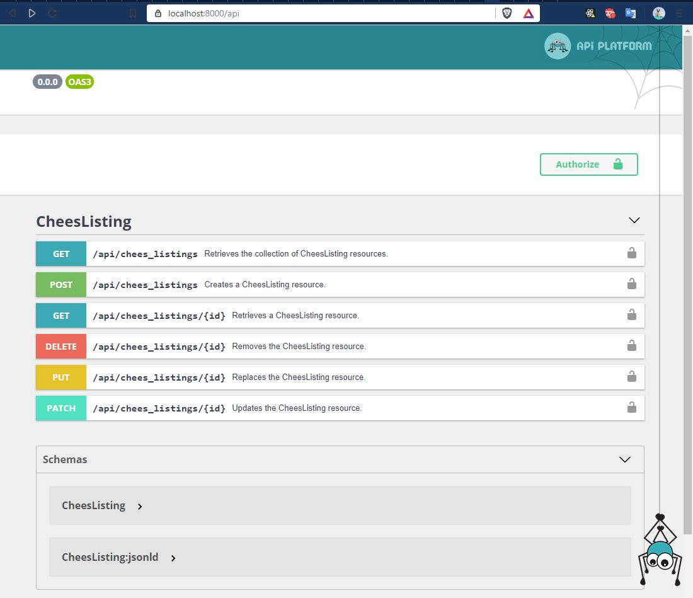

# symfony-fusionauth-api-starter
Minimalistic example API project using FusionAuth, Symfony &amp; Api-Platform




# How to create your own api

# Requirements

https://symfony.com/download

https://yarnpkg.com/lang/en/docs/install/


# Create your project:

```composer create-project symfony/skeleton symfony-fusionauth-api-starter```


# Enter the project directory.

```cd symfony-fusionauth-api-starter```

# Install dependencies.

```
composer require api
composer require symfony/security-bundle
composer require jerryhopper/easy-jwt-php
```

# Install optional dependencies.
```
composer require symfony/webpack-encore-bundle
composer require api-platform/admin-pack
composer require webonyx/graphql-php


yarn add react react-dom @api-platform/admin @babel/preset-react@^7.0.0 --dev

```

# Copy the required files from this repository.

Only 3 files (Userprovider, User and GuardAuthenticator ) are required. 

```
src/Security/User.php
src/Security/UserProvider.php
src/Security/JwtTokenAuthenticator.php
```

# Configure 


config/packages/api_platform.yaml
```
api_platform:
    mapping:
        paths: ['%kernel.project_dir%/src/Entity']
    patch_formats:
        json: ['application/merge-patch+json']
    swagger:
        versions: [3]
        api_keys:
            apiKey:
                name: Authorization
                type: header
```

config/packages/security.yaml
```
security:
    # https://symfony.com/doc/current/security.html#where-do-users-come-from-user-providers
    providers:
        in_memory: { memory: null }
        app_user_provider:
            id: App\Security\UserProvider
    firewalls:
        dev:
            pattern: ^/(_(profiler|wdt)|css|images|js)/
            security: false
        main:
            anonymous: true
        api:
            pattern: ^/api/
            stateless: true
            anonymous: ~
            provider: app_user_provider
            # activate different ways to authenticate
            # https://symfony.com/doc/current/security.html#firewalls-authentication

            # https://symfony.com/doc/current/security/impersonating_user.html
            # switch_user: true

    # Easy way to control access for large sections of your site
    # Note: Only the *first* access control that matches will be used
    access_control:
        # - { path: ^/admin, roles: ROLE_ADMIN }
        # - { path: ^/profile, roles: ROLE_USER }
        - { path: ^/api/, roles: ROLE_USER }
    #providers:
    #    # used to reload user from session & other features (e.g. switch_user)

```

# Enviroment values

.env

```
JWT_TOKEN_HEADER=Authorization
JWT_TOKEN_HEADERPREFIX=Bearer

FUSIONAUTH_DISCOVERY_URL=https://fusionauth:9011/.well-known/openid-configuration
FUSIONAUTH_CHECK_AUD=false
FUSIONAUTH_CHECK_ISS=false

```


# And you are done!

Obviously, you need to create some entities & configure the databasesettings before you actually see some endpoints.


# starting the project
```
php bin/console cache:clear

yarn encore dev

symfony serve
```

